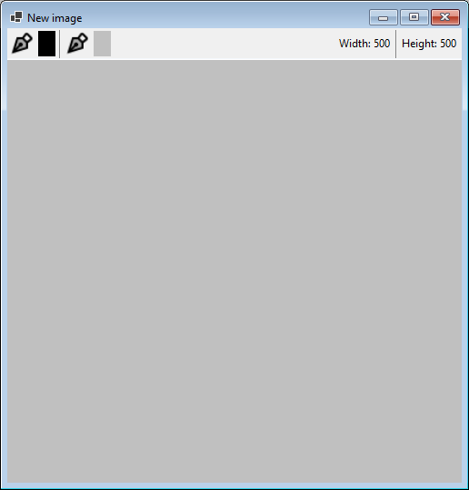

# COMP3951_Lab5_WillOtterbein_dotnet
Will Otterbein, COMP3951 Lab5, March 3 2025

## Features
The following sections outline the fetures of this application, explaining how to use the application.

---
### ✏️ Drawing
This section explains how to draw with this application.

1. Left-click to draw with the main pen, black ⬛ by default.
2. Right-click to draw with the secondary pen, white ⬜ by default.

> [!NOTE]
> Pen configuration is explained in the following table

| Pen                                                           | Pen Colour                            | Pen Thickness                                     | Default Configuration                                     |
| ------------------------------------------------------------- | ------------------------------------- | ------------------------------------------------- | --------------------------------------------------------- |
| Main pen          | Click **Select** in the pop-up pen menu | Enter a number > 0 or use the up-down selectors   |      |
| Secondary pen     | Click **Select** in the pop-up pen menu | Enter a number > 0 or use the up-down selectors   |    |

---
### 🖼️ Creating New Drawings
This section describes how to create a new drawing.

1. Click **Window** in the main window toolbar.
2. From the Window dropdown, click **New**.
3. Optionally, use the up/down selectors for width and height to set the width and height of the new drawing.

4. Optionally, click the **Select** button to choose the background colour of the new drawing.

5. Click **Confirm** to create the drawing in a new child window.
6. You should see a blank canvas with your configured width/height and background colour.

---
### 📁 Loading Images from the File System
This section describes how to load an image for drawing from the file system.

1. Click **File** in the main window toolbar.
2. From the File dropdown, click **Open File**.
3. Select a file from your file system.

4. You will see a new canvas with the image.

> 📘 **Note**  
> The width/height will be that of the image, the main and secondary colours are the defaults, black and white.

---
### 🛜 Loading Images from the Internet 
This section describes how to load an image for drawing from the file system.

1. Click **File** in the main window toolbar.
2. From the File dropdown, click **Open Internet**.
3. Enter the URL of your image
4. Click **Load**.

> ⚠️ **Warning**  
> If a non-image resources is indicated by the URL, the loading will fail and you will need to specify a new URL to an image resource.

4. Upon successful retrieval of the image, the preview pane will be populated w/ your image.

5. Click **Confirm**
6. You will see a new canvas with the image.

---
### 💾 Saving Drawings to Images
This section describes how you can save files to the file system.

1. Click **File** in the main window toolbar.
2. From the File dropdown, click **Save File**.
3. Navigate to a suitable location on your system.
4. Give the file a suitable name and select the file type

5. Click **Save**.
6. If the file already exists, either give the file a new name or overwrite the existing file.
